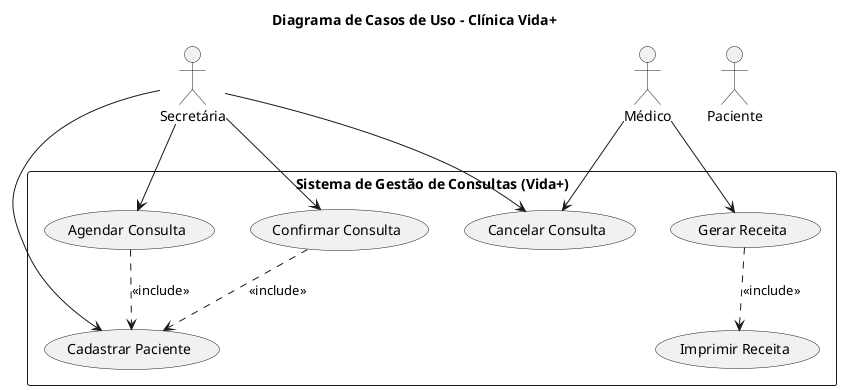

```plantuml
@startuml
skinparam packageStyle rectangle
title Diagrama de Casos de Uso - Clínica Vida+

actor "Secretária" as sec
actor "Médico" as med
actor "Paciente" as pac

rectangle "Sistema de Gestão de Consultas (Vida+)" {
    usecase "Cadastrar Paciente" as UC_CAD
    usecase "Agendar Consulta" as UC_AGE
    usecase "Confirmar Consulta" as UC_CONF
    usecase "Cancelar Consulta" as UC_CANC
    usecase "Gerar Receita" as UC_REC
    usecase "Imprimir Receita" as UC_IMP
    
    UC_AGE ..> UC_CAD : <<include>>
    UC_CONF ..> UC_CAD : <<include>>
    UC_REC ..> UC_IMP : <<include>>
}

sec --> UC_CAD
sec --> UC_AGE
sec --> UC_CONF
sec --> UC_CANC

med --> UC_CANC
med --> UC_REC
@enduml
```
